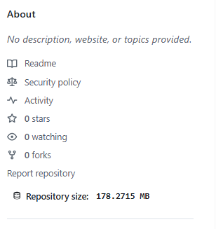

# GitHub Repo Size - Chrome Extension

  
**Muestra el tamaño de repositorios de GitHub directamente en la página del repositorio**

---

## 🔍 Descripción

Extensión para Chrome que muestra el tamaño de un repositorio de GitHub (en MB) junto a la sección de "Forks", integrado visualmente con el diseño de GitHub.

## ✨ Características

- ✅ Muestra el tamaño del repositorio en MB
- ✅ Diseño que combina con la interfaz de GitHub
- ✅ Cache local para mejor rendimiento
- ✅ Compatible con la navegación SPA de GitHub
- ✅ Precisión decimal configurable
- ✅ Icono SVG integrado

## 🛠 Instalación

### Opción 1: Chrome Web Store
(Próximamente)

### Opción 2: Instalación manual
1. Descarga el código fuente (ZIP)
2. Descomprime los archivos
3. Abre Chrome y ve a `chrome://extensions/`
4. Activa "Modo desarrollador" (interruptor superior derecho)
5. Haz clic en "Cargar extensión sin empaquetar" y selecciona la carpeta

## 📸 Capturas de Pantalla

  
*El tamaño del repositorio aparece junto a los forks*

## ⚙️ Configuración

Edita `content.js` para personalizar:
```javascript
const CONFIG = {
    decimalPrecision: 4,       // Número de decimales
    measurementUnit: 'MB',     // Unidad de medida
    // Estilos personalizables...
};